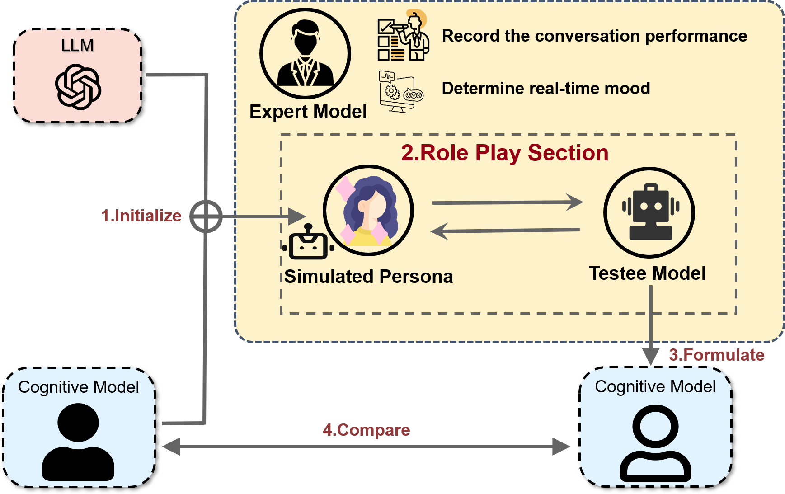
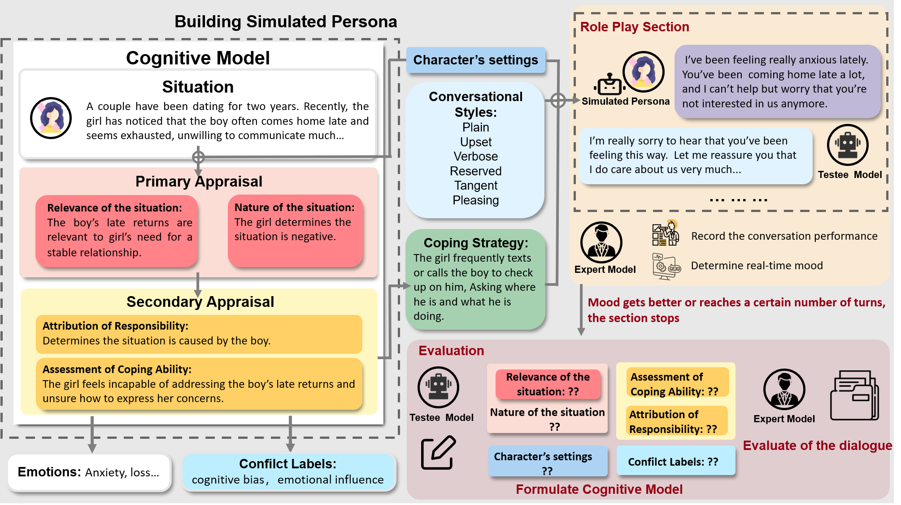
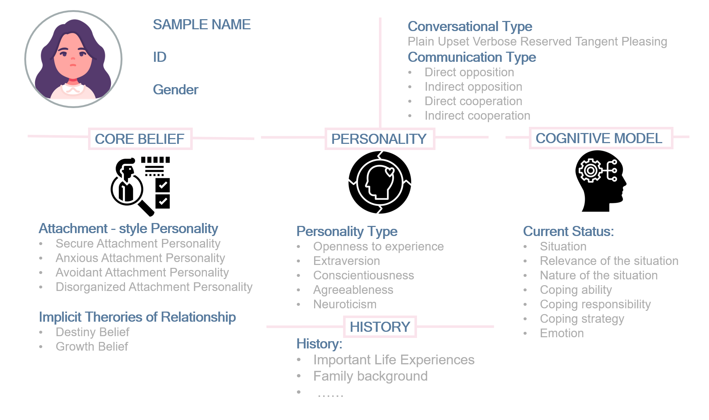

# LQBench: 亲密关系情商基准测试框架

## 项目简介

LQBench是一个专门针对大语言模型（LLMs）在亲密关系情感交流能力评估的基准测试框架。随着大语言模型日益成为人们情感寄托的载体，我们发现现有的LLM评估体系很少关注模型在亲密关系领域的表现。本项目旨在填补这一研究空白，为评估大语言模型的情商和在亲密关系场景中的表现提供全面的基准测试。

## 研究背景

当前大语言模型的情感智能研究主要集中在：
- 情感分类与识别
- 生成体现情感的回应
- 评估模型对人类心理状态的理解能力

然而，这些研究很少涉及：
- 复杂情感需求的洞察（如亲密关系矛盾中隐藏的深层次情感需求）
- 在亲密关系场景中的情感安抚能力
- 考虑个体差异和认知模型对情感场景影响的评估

## 我们的创新

LQBench通过以下创新点解决现有研究的局限性：

1. **真实的人类模拟**：我们设计了完整的认知模型框架，模拟真实人类在亲密关系矛盾中的潜意识反应和情绪变化
2. **多维度的虚拟人格**：基于心理学理论构建160种不同性格特征的虚拟人格，包括依恋类型、沟通风格、关系信念和性格特质
3. **基于真实数据的场景**：从中文社交媒体平台采集真实的亲密关系矛盾场景，确保评估场景的真实性和代表性
4. **专业的评估框架**：引入专家模型作为评委，评估测试模型在对话中的表现及其对虚拟人格认知模型的推断能力

## 评估框架



我们的评估过程包括：
1. 用LLM初始化虚拟人格及其认知模型
2. 在特定场景中让虚拟人格与测试模型进行多轮对话
3. 专家模型评估测试模型的表现及虚拟人格的情绪变化
4. 测试模型推断虚拟人格的认知模型
5. 综合专家评分和认知模型推断准确度得出最终评分

## 认知模型设计



我们的认知模型基于心理学的认知评估理论(Cognitive Appraisal Theory)，包括：
- 情境相关性评估(Relevance of the situation)
- 情境性质评估(Nature of the situation)
- 责任归因(Attribution of responsibility)
- 应对能力评估(Assessment of coping ability)

## 虚拟人格设计



每个虚拟人格包含：
- 核心信念(Core beliefs)
- 性格特质(Personality traits)
- 过往经历(Past experiences)
- 应对策略(Coping strategies)

## 数据来源

我们从知乎和小红书等中文社交媒体平台收集真实的亲密关系问题与冲突场景，通过大数据统计方法筛选最具代表性的场景进行测试。

## 项目进展

- [x] 完成评估框架设计
- [x] 认知模型理论构建
- [x] 虚拟人格多维度特征定义
- [ ] 数据采集与筛选
- [ ] 专家模型训练
- [ ] 初步评估测试
- [ ] 基准测试发布

## 联系我们

如有任何问题或建议，欢迎联系项目组或提交Issue。

## 引用

如果您的研究中使用了LQBench，请引用我们的论文：

```
@article{lqbench2024,
  title={LQBench: A Framework for Evaluating Large Language Models' Emotional Intelligence in Intimate Relationships},
  author={[Authors]},
  journal={[Journal/Conference]},
  year={2024}
}
``` 